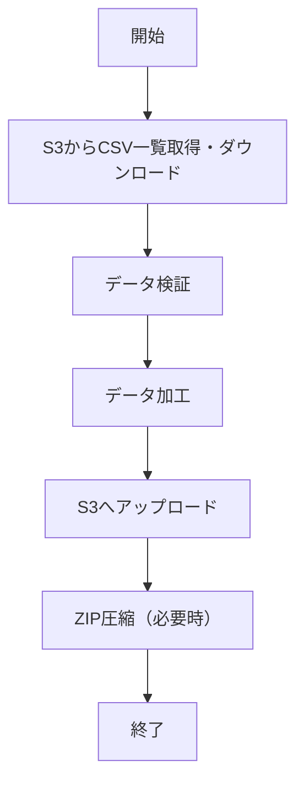
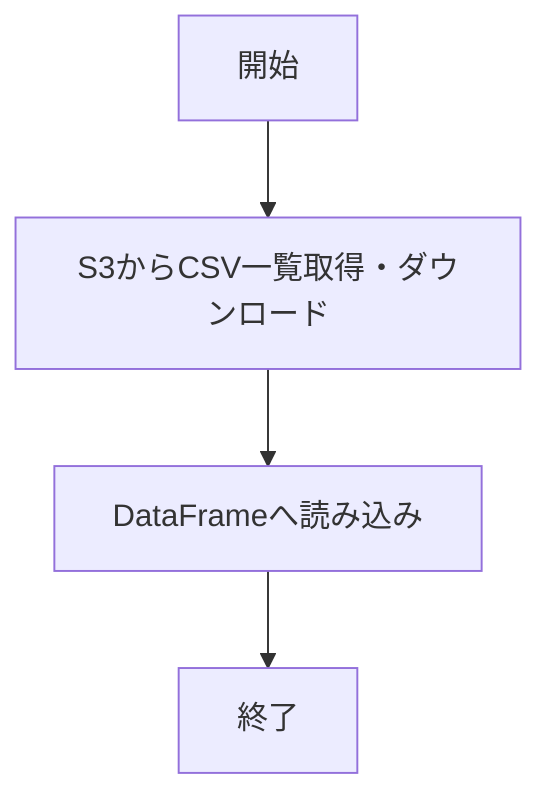
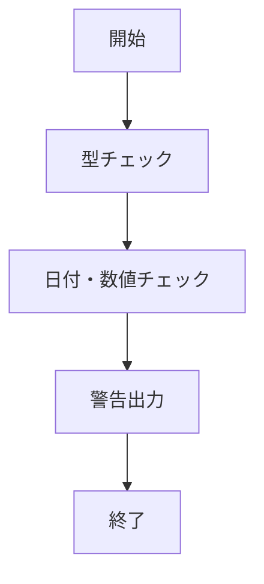
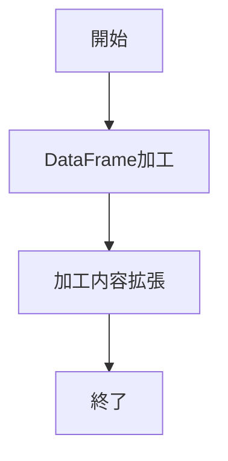
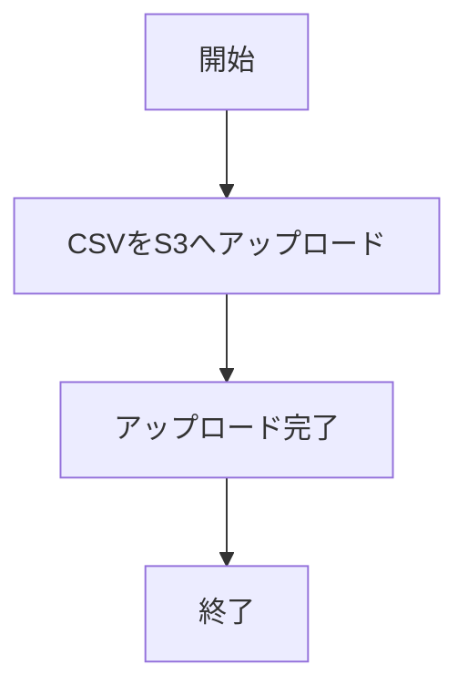
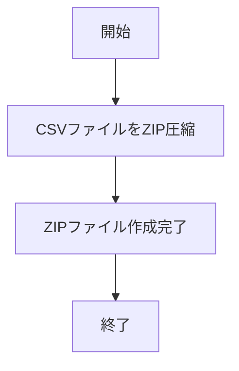

# 機能全体設計書

## 1. システム概要
本システムは、AWS S3バケットからCSVファイルの一覧取得・ダウンロード、データの検証・加工、再度S3へアップロード、ZIP圧縮までを一連で行うバッチ処理を提供します。主な処理はPythonスクリプトで実装されています。

## 2. 処理フロー図

## 3. 機能一覧
1. S3からのCSVファイル一覧取得・ダウンロード（s3_download.py）
2. データ検証（型チェック・日付チェック等）
3. データ加工
4. 加工済みCSVのS3アップロード
5. 複数CSVのZIP圧縮

## 4. 各機能の詳細
### 4.1 S3からのCSVファイル一覧取得・ダウンロード

- 指定バケット・プレフィックス・日付でCSVファイルをリストアップし、対象CSVをダウンロードしてPandas DataFrameとして読み込み
- `s3_download.py` の `list_csv_files` および `download_csv` 関数で実装

### 4.2 データ検証

- columns.txtで定義された型情報に基づき、各カラムの型チェックを実施
- 日付型・数値型の不正値を検出し、警告を出力
- `check_process.py` の `check_values` 関数で実装

### 4.3 データ加工

- 必要に応じてDataFrameの加工処理を実施（例：欠損値補完、不要カラム削除等）
- 加工内容は要件に応じて拡張可能

### 4.4 加工済みCSVのS3アップロード

- 加工後のDataFrameをCSVとしてS3へアップロード
- `s3_upload.py` の `upload_csv` 関数で実装

### 4.5 複数CSVのZIP圧縮

- 複数CSVファイルをZIP形式でまとめる
- `s3_upload.py` の `zip_csv_files` 関数で実装

## 5. ディレクトリ構成
- script.py: メインバッチスクリプト
- s3_download.py: S3からの一覧取得・ダウンロード関連
- s3_upload.py: S3へのアップロード・ZIP圧縮関連
- check_process.py: データ検証処理
- columns.txt: カラム名と型定義
- test_*.py: 各種ユニットテスト

## 6. 環境変数
- .envファイルでS3バケット名、プレフィックス、日付、ダウンロードディレクトリ等を指定

---
2025年6月11日 作成
