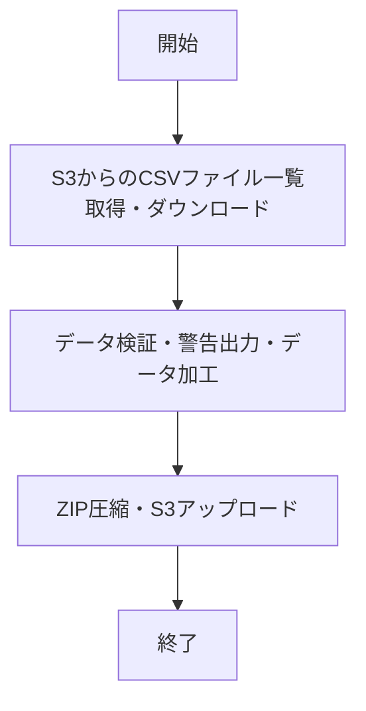
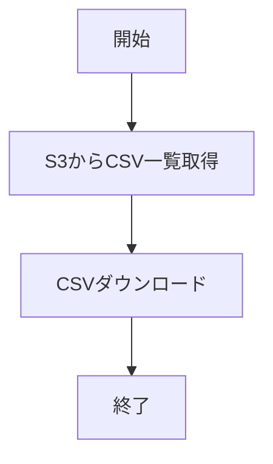
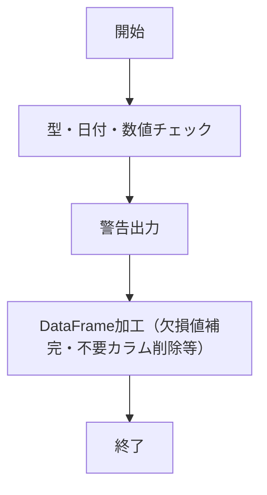
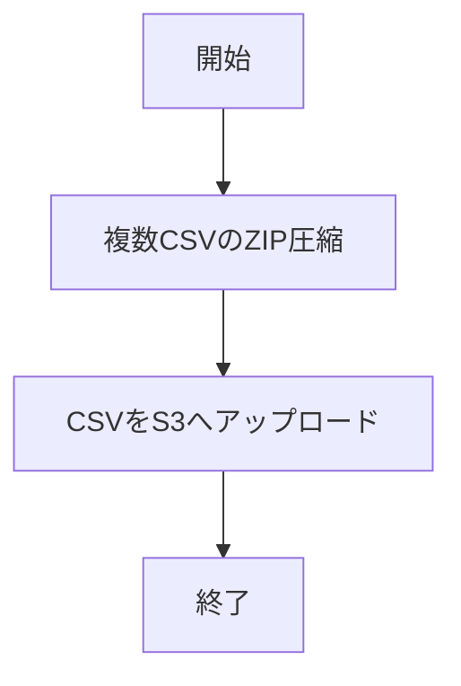

# 機能全体設計書

## 1. システム概要
本システムは、AWS S3バケットからCSVファイルをダウンロードし、データの検証・加工を行い、再度S3へアップロードするバッチ処理を提供します。主な処理はPythonスクリプトで実装されています。

## 2. 処理フロー図

## 3. 機能一覧
1. S3からのCSVファイル一覧取得・ダウンロード
2. データ検証・警告出力・データ加工
3. ZIP圧縮・S3アップロード
4. 複数CSVのZIP圧縮

## 4. 各機能の詳細

本設計では、関連する機能をまとめて記載しています。
### 4.1 S3からのCSVファイル一覧取得・ダウンロード

- 指定バケット・プレフィックス・日付でCSVファイルをリストアップし、対象CSVをダウンロードする
- `s3_download.py` の `list_csv_files` および `download_csv` 関数で実装

### 4.2 データ検証・警告出力・データ加工

- columns.txtで定義された型情報に基づき、各カラムの型チェックや日付型・数値型の不正値検出、警告出力を行い、必要に応じてDataFrameの加工処理（例：欠損値補完、不要カラム削除等）を実施
- `check_process.py` の `check_values` 関数等で実装

### 4.3 ZIP圧縮・S3アップロード

- 複数CSVファイルをZIP形式でまとめて、S3へアップロードする
- `s3_upload.py` の `zip_csv_files` および ``upload_csv 関数で実装

## 5. ディレクトリ構成
- script.py: メインバッチスクリプト
- s3_download.py: S3からのダウンロード関連
- s3_upload.py: S3へのアップロード・ZIP圧縮関連
- check_process.py: データ検証処理
- columns.txt: カラム名と型定義
- test_*.py: 各種ユニットテスト

## 6. 環境変数
- .envファイルでS3バケット名、プレフィックス、日付、ダウンロードディレクトリ等を指定

---
2025年6月11日 作成
